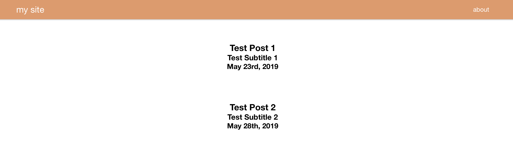
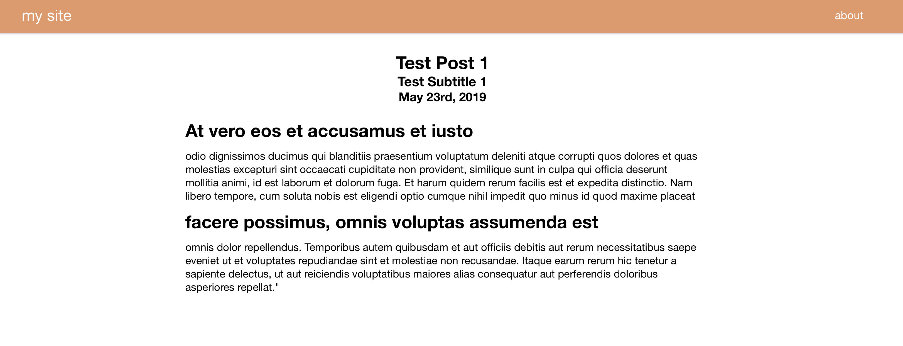

expressCMS
====

  

expressCMS is the frontend and CMS backend I use on my [personal blog.](http://blog.rauchp.com/) The frontend was created with Express + [Pug.JS](https://github.com/pugjs/)  and the backend uses SQLite for storing and reading from the database. All posts are written in Markdown. The purpose of this repo is to share a backend implementation using [node-sqlite3.](https://github.com/mapbox/node-sqlite3) There really isn't enough sample code for this library online. Feel free to use this code as inspiration or as a boilerplate for your own site.

## Table of Contents
- [Requirements](#requirements)
- [Install](#install)
- [Configuration](#configuration)
- [Notes](#Notes)
- [License](#license)

## Requirements

[npm](http://npmjs.com/) 6.0 or newer.

## Install
1. Pull from repo
2. `npm install`
3. Configure config.json
4. `npm start`

## Configuration

Inside `config.json` there are a number of settings that can be configured.
  
- `site_name` - Sets the header text and the title of the html head at `/`  

- `site_password` - Using [this site](https://www.browserling.com/tools/bcrypt), you can generate a bcrypt-secured password to use for creating/modifying/deleting posts. 
- `posts_per_page` - Sets the amount of posts that are displayed on each page
- `btn_one_name` - Allows you to set the the text for a button on the right side of the header.
- `btn_one_link `- Allows you to add a URL to this text.

## Notes 
* If you'd like to backup your posts, you can find all the information posted in the `database/sqlite_default.db` file
* To add more global constants or add more links to the header, you must modify the custom middleware in `/app.js` and add your variables to the options variable. From there you can modify the default.pug view to change the header.

## Images 

	

  	
  	 
  	The home page.
	

 

	

  	
  	 
  	An example post.
	

 

## License

expressCMS is licensed under the [copyfree](http://copyfree.org) ISC License.